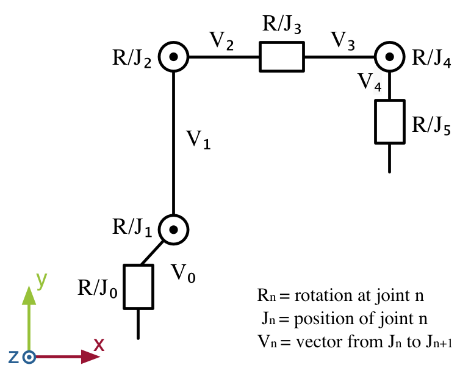
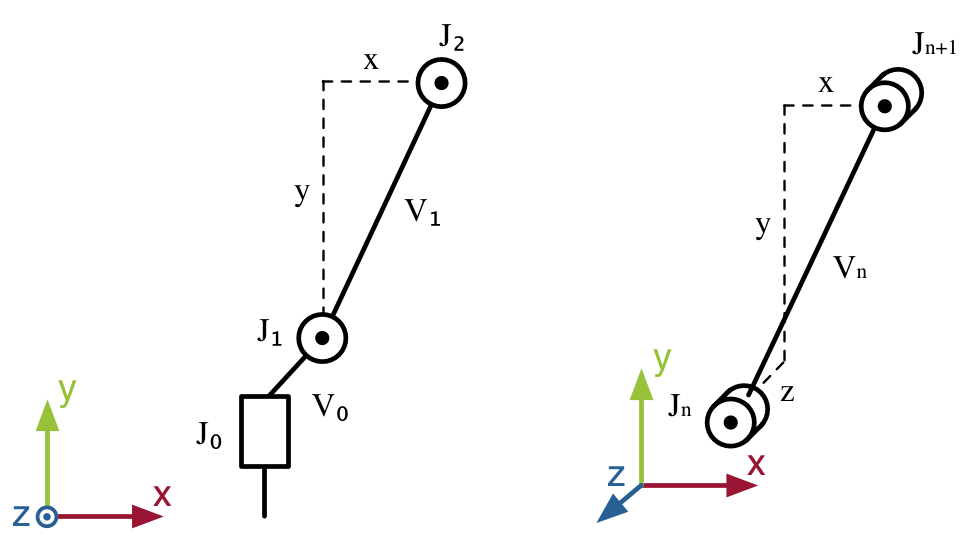
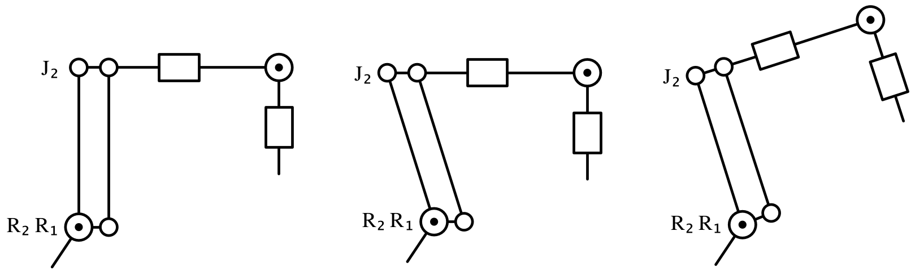
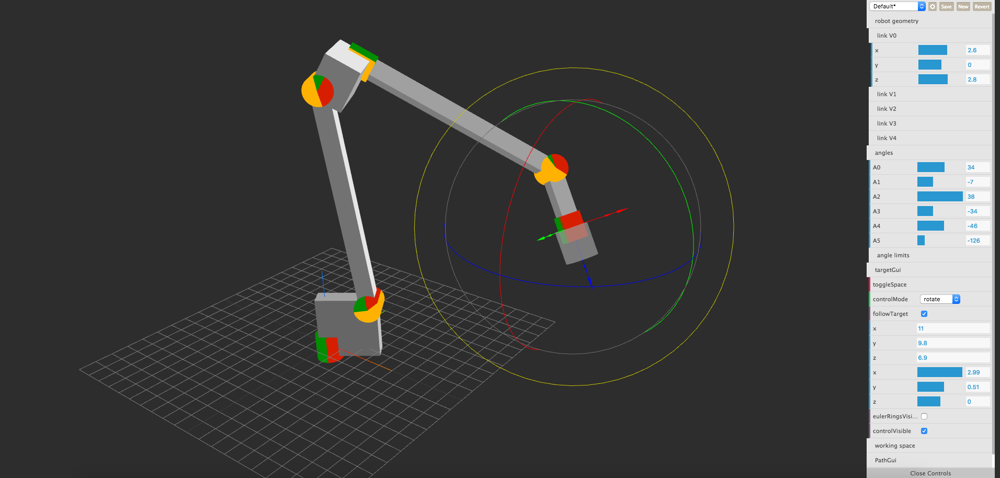

# Robot Simulation (Kinematics)

[](LICENSE.md)
[](https://www.npmjs.com/package/robot-simulation)

6DOF robot kinematics in JavaScript.

## Install
```console
npm install robot-simulation --save
```

## Use
```js
import RobotSimulation from 'robot-simulation'

const geometry = [
      [1,  1,  0], // V0: 1x 1y
      [0, 10,  0], // V1: 10y
      [5,  0,  0], // V2: 5x
      [3,  0,  0], // V3: 3x
      [0, -3,  0], // V4: -3y
    ]

const RobotKin = new RobotSimulation(geometry)

let angles = [1.57, 1.2, 0, 0.3, 2.2, 1.1]

const pose = RobotKin.forward(...angles)[5]

angles = RobotKin.inverse(...pose)
```
## Geometry
The geometry array consists of 5 entries describing the links *V0-V5*. Each *Vn* is a tuple of 3 coordinates from *Jn* to *Jn+1*.
One constraint: The y,z of *V3* and x,z of *V4* must be 0 for the kinematics to work.
<p align="center">
  
</p>
<p align="center">
  
</p>

## API

**forward**

```js
RobotKin.forward(R0, R1, R2, R3, R4, R5)
```
returns
```
[ 
  [  0,      0,     0 ], //J0
  [  0.5,    1,  -0.8 ], //J1
  [ -0.2, -8.8,   0.3 ], //J2
  [  1.8, -5.6,  -2.8 ], //J3
  [  3.0, -3.6,  -4.7 ], //J4
  [  4.7, -1.3,  -5.5,  1,  6,  -2.8 ] //J5 + TCP Euler angles
]
```

**inverse**

*X,Y,Z* coordinates, *A,B,C* Euler angles in order 'abc'.

```js
RobotKin.inverse(X, Y, Z, A, B, C)
```
returns
```
[  2, 1.6,  2.1, -3.5,  1, -1.5 ] //array of angles
[  1, 2.3,  3.1,  NaN, NaN, NaN ] //NaN for out of reach angles
```

## kinematic coupling
This library assumes a robot with a series of joints. Some robots may have different kinematics. The depicted robot has a hinge at *J1* and R1/R2 are at the same kinematic position. Therefore moving *R1* also changes the angle at *J2*. To account for that, *R2* has to move the same amount.



Using that information, you can use the solver to calculate the initial angles and correct them according to your kinematics.

```js
let angles = RobotKin.inverse(...pose)
angles[2] += angles[1]
//set angles, do stuff 🤖
```

## TODO
- robot configuration
- comply with DH for TCP orientation?
- more kinematic chains

## Demo

See the kinematics in action: https://ulikgames.github.io/robot-control-panel/

The gui is available in this repo: https://github.com/UlikGames/robot-control-panel
